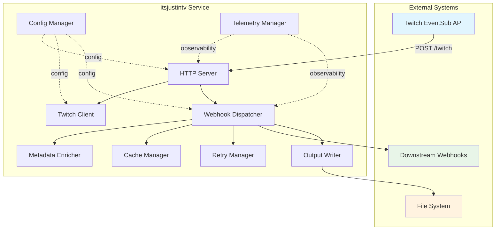
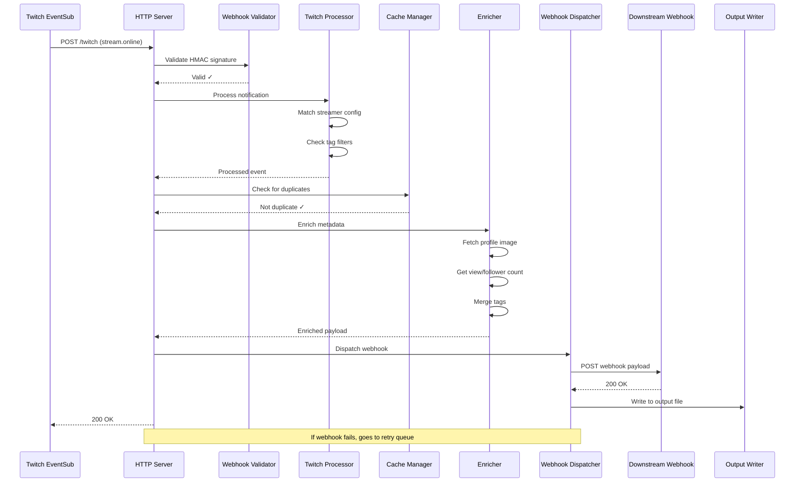
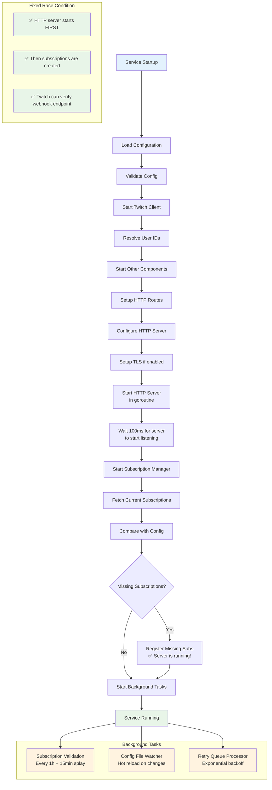
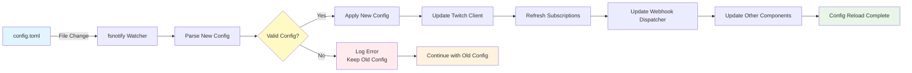
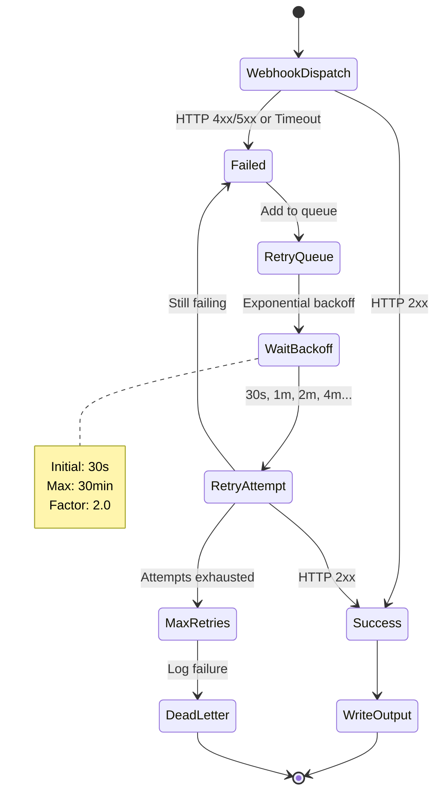
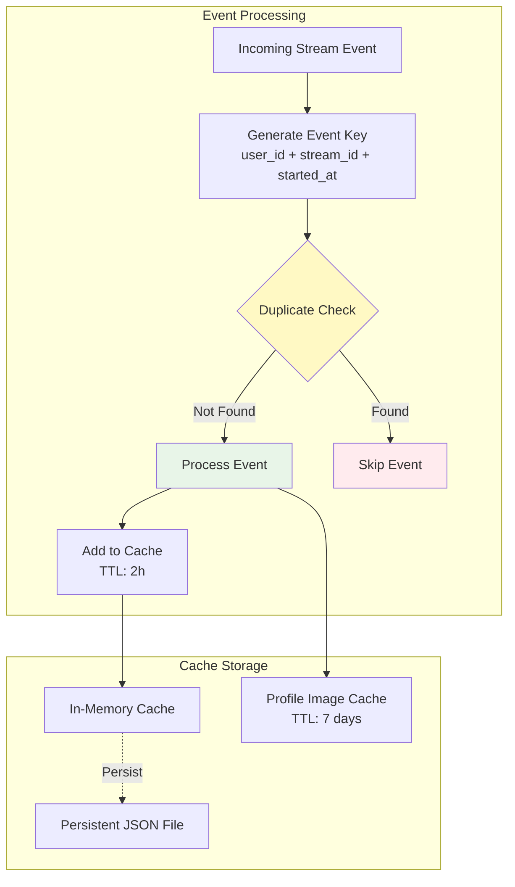
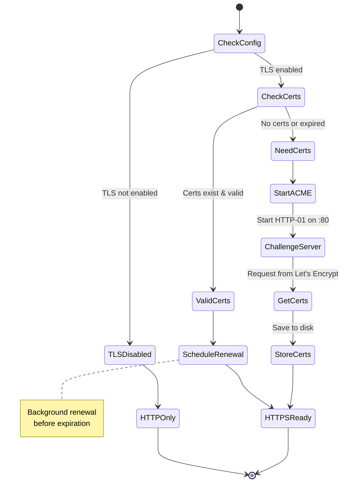
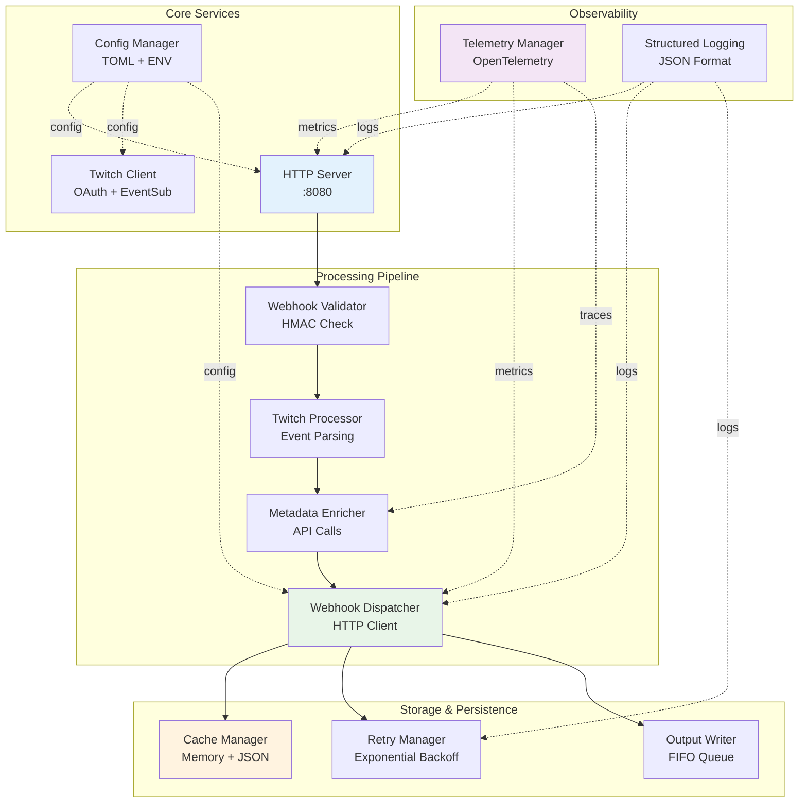
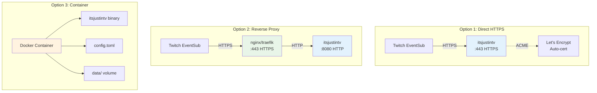

# itsjustintv Workflow Diagrams

## 1. High-Level System Architecture

## 2. Webhook Receipt and Processing Flow

## 3. Service Startup and Subscription Management

## 4. Configuration Hot-Reload Workflow

## 5. Retry Logic and Error Handling

## 6. Cache and Deduplication Strategy

## 7. Metadata Enrichment Pipeline

```mermaid
flowchart LR
    A[Stream Event] --> B[Base Payload Creation]
    B --> C[Profile Image Fetch]
    C --> D{Image Cached?}
    D -->|Yes| E[Use Cached Image]
    D -->|No| F[Fetch from Twitch API]
    F --> G[Cache Image<br/>7 days TTL]
    G --> E
    E --> H[Get View Count]
    H --> I[Get Follower Count]
    I --> J[Fetch Stream Tags]
    J --> K[Merge with Config Tags]
    K --> L[Detect Language]
    L --> M{Tag Filter Match?}
    M -->|No| N[Block Webhook]
    M -->|Yes| O[Enriched Payload Ready]
    
    style D fill:#fff9c4
    style M fill:#fff9c4
    style N fill:#ffebee
    style O fill:#e8f5e8
```

## 8. TLS Certificate Management

## 9. Component Interaction Overview

## 10. Deployment Architecture Options

These diagrams illustrate the complete workflow and architecture of the itsjustintv service, showing how components interact and data flows through the system.